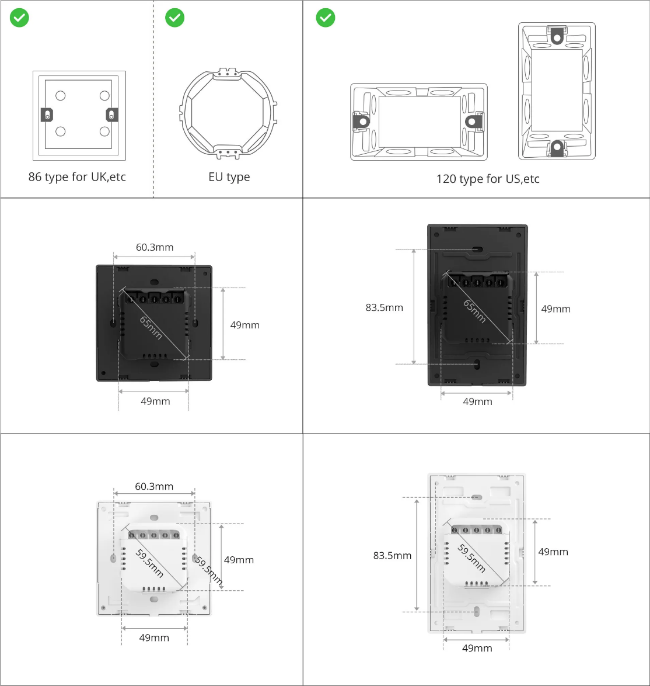
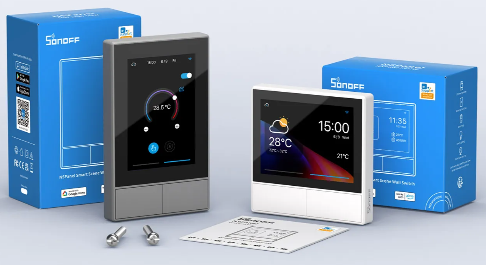
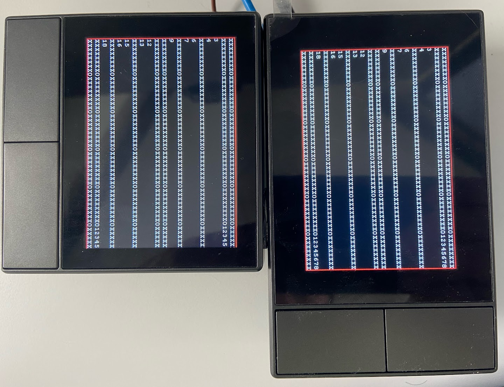

# About panel models (EU x US x US landscape)

I've seen multiple questions about the possibilities of using the US panel in Europe, or using the US panel in landscape, etc., so I will put here some of my discoveries and thoughts about this.

## The differences between the EU and US models

Probably the Sonoff page will be the best source of info around this, so please take a look there first:

1. [Sonoff NSPanel product page](https://sonoff.tech/product/central-control-panel/nspanel/)
1. [Sonoff NSPanel user's manual](https://sonoff.tech/wp-content/uploads/2021/11/%E8%AF%B4%E6%98%8E%E4%B9%A6-NSPanel-V1.1-20210826.pdf)

### Installing a US panel in EU

Please be aware that the standards are different, so your regular electrical box in Europe may not have the holes fitting the right place for the US model.
The screws in EU are 60mm apart, while in US they are 83.5mm and are typically on in the vertical axe,
so you probably will have to adapt your wall in order to be able to fit the US model in an European electrical box.

### The screen size

Although both models have the same screen size (480x320px vs 320x480px), you may notice some differences:

#### The borders in the US model are larger, giving a feeling that the screen is a bit bigger, and at the same time the smaller border on the EU model gives a feeling of a bit more modern technology

#### In the EU version, parts of the screen are not visible

This is a little bit of a shame, but for some reason Sonoff sacrificed a bit of the (supposed to be) visible part of the display in the EU model:

The 30 most right pixels are not visible in the EU model, making the useful area only 450x320 (although printing into that area won't cause any issue).

As you can see in this picture, where I've used the exactly same TFT file for both models, the number of pixels unavailable on the EU version is not negligible.

If you are using the blueprint from this project, that shouldn't be an issue, as the UI was developed taking these differences in account,
but if you are planing to customize your displays, be aware that the US version will give you a few more pixels to play.

#### Using the US model in landscape mode

If you can use the US model in landscape mode, you can simple upload the EU version of the TFT file and everything will be operational,
however on the home page you will see the labels for the physical buttons in the bottom, while the buttons will be in the right side:

You can always try to use the nspanel_eu.hmi with the [Nextion editor](https://nextion.tech/nextion-editor/)
to move those blue bars to the position where the buttons are in the reality and then generate a custom nspanel_eu.tft which you could upload to your panel,
but take these points in accout:

1. I couldn't find any easy way to rotate text in the Nextion editor, so you probably will have to remove those labels or it will look quite weird.
1. Any customization to this project files won't be supported by the project's team. ;)

Hopefully this helped you.
Please share in the comments if you have any other findings or thoughts about this topic.

---

Edit - 2023-09-20:
US Landscape mode is now included on v4.0: Blackymas/NSPanel_HA_Blueprint#1057
